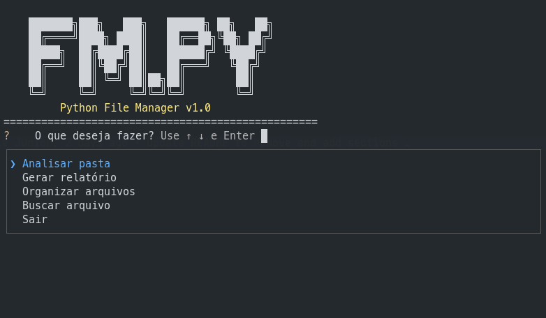

# Python File Manager


## 📑 Índice

| Seção |
|--------|
| [📖 Sobre o Projeto](#-sobre-o-projeto) |
| [🚀 Funcionalidades](#-funcionalidades) |
| [🛠️ Tecnologias Utilizadas](#️-tecnologias-utilizadas) |
| [📁 Estrutura do Projeto](#-estrutura-do-projeto) |
| [▶️ Como Executar](#️-como-executar) |
| [🎯 Objetivos de Aprendizado](#-objetivos-de-aprendizado) |
| [📚 Conceitos Utilizados](#-conceitos-utilizados) |
| [🔮 Melhorias Futuras](#-melhorias-futuras) |
| [👨‍💻 Autor](#-autor) |

## 📖 Sobre o Projeto

O Python File Manager é uma aplicação de linha de comando desenvolvida para praticar manipulação de arquivos e diretórios utilizando a biblioteca `os` do Python.

O projeto permite analisar diretórios, gerar relatórios com informações detalhadas e organizar arquivos automaticamente em categorias com base em suas extensões.

---

## 🚀 Funcionalidades

### 📂 Análise de Diretórios

* Contagem de diretórios.
* Contagem de arquivos.
* Cálculo do tamanho total dos arquivos.
* Identificação do maior arquivo encontrado.

### 📝 Geração de Relatórios

* Criação automática de relatórios em arquivo `.txt`.
* Registro da data e hora da análise.
* Informações detalhadas sobre o diretório analisado.

### 🗂️ Organização de Arquivos

Os arquivos são organizados automaticamente em pastas de acordo com suas extensões.

Categorias suportadas:

| Categoria    | Extensões                                   |
| ------------ | ------------------------------------------- |
| Documents    | .pdf, .docx, .odt                           |
| Images       | .jpg, .jpeg, .png, .bmp, .tiff, .ico, .heic |
| Videos       | .mp4, .avi, .mkv, .mov, .wmv, .webm         |
| Audio        | .mp3, .wav, .flac                           |
| Spreadsheets | .xlsx, .xls, .csv, .ods                     |
| Others       | Arquivos não categorizados                  |

---

## 🛠️ Tecnologias Utilizadas

* Python 3
* Biblioteca os
* Biblioteca datetime

---

## 📁 Estrutura do Projeto

```text
python-file-manager/
│
├── main.py
├── scanner.py
├── organizer.py
├── reports.py
├── search.py
├── utils.py
│
├── reports/
├── images/
│   ├── menu.png
│   └── organizer.png
│
├── README.md
└── .gitignore
```

---

## ▶️ Como Executar

Clone o repositório:

```bash
git clone https://github.com/Paulinellejr/file-manager-python.git
```

Entre na pasta do projeto:

```bash
cd python-file-manager
```

Instale as dependências:

```bash
pip install -r requirements.txt
```

Execute o programa:

```bash
python main.py
```
---

## 💡 Exemplo de Uso

### Análise de Diretório

Entrada:

```bash
Caminho: /home/user/Downloads
```
Saida:

```
Diretórios: 5
Arquivos: 120
Tamanho Total: 2.35 GB
Maior Arquivo: curso-python.mp4
Tamanho: 1.2 GB

```

### Gerar relatório

Entrada:

```bash
Caminho: /home/user/Downloads
```
Saida:

```bash
Relatório salvo em: reports/report_YYYY-MM-DD_HH-MM-SS.txt
```
Exemplo de Relatório

```text
===== RELATÓRIO =====

Diretórios: 14558
Arquivos: 114871
Tamanho Total: 2.51 GB

Maior Arquivo:
next-swc.linux-x64-gnu.node
Tamanho:
125.32 MB

```

### Buscar arquivo

Entrada:

```bash
Caminho: /home/user/Downloads
Arquivo: report
```
Saida:
```bash
Downloads/
├── report.pdf
├── final_report.pdf
├── report.txt
└── Projetos/
    └── report_2026.docx
```

___

## 📸 Demonstração

### Menu Principal



### Organização de Arquivos


___
### ⚡ Recursos Extras

* Barra de progresso durante a organização.
* Formatação amigável de tamanhos (KB, MB, GB).
* Interface de linha de comando interativa.

---

## 🎯 Objetivos de Aprendizado

Este projeto foi desenvolvido com o objetivo de praticar:

* Manipulação de arquivos e diretórios.
* Tratamento de exceções.
* Organização de código em módulos.
* Estruturas de dados (dicionários).
* Desenvolvimento de aplicações em linha de comando.
* Uso da biblioteca `os`.

---

## 📚 Conceitos Utilizados

Durante o desenvolvimento foram utilizados:

* `os.walk()`
* `os.scandir()`
* `os.path.exists()`
* `os.path.isdir()`
* `os.path.join()`
* `os.path.splitext()`
* `os.path.basename()`
* `os.makedirs()`
* `os.rename()`

---

## 🔮 Melhorias Futuras

* Identificação de arquivos duplicados.
* Backup automático antes da organização.
* Exportação de relatórios em CSV.
* Testes automatizados.

---

## 👨‍💻 Autor

Desenvolvido por Paulinelle Junior como projeto de estudo para aprofundar conhecimentos em Python e manipulação do sistema de arquivos.

## 📄 Licença

Este projeto está licenciado sob a licença MIT.
Consulte o arquivo LICENSE para mais detalhes.
